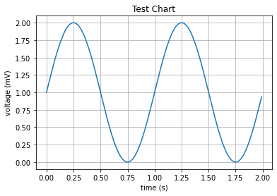
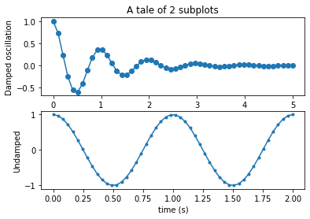

# Python Programming for Begginers Demo 0


```python
print("Hello world!")
```

    Hello world!


## Intro

- Everyone can learn programming, it's never been easier.
- This course is for those who want to use Python, practically starting day 1
- This course is for begginers to programming.
- Programming is creative
    - Problem solving
    - Many paths to the same place
- Automate boring, repetitive tasks
    - file naming
    - spread sheets
    - emails
    - online form
- Use a search engine, someone has probably had the same error
    - Stackoverflow
    - Github
    
## What is a program? 
    - Set(s) of instructions. Do this then do this. If this happens, then this. 
    - A program is made up of many algorithms
    - Software is often made up of many different programs
    - The lines between these can be blurry
    
## How does it work?
    - Computer code is an abstraction of the underlying hardware, a fixed set of logical operations on 32 or 64 bit values (think 0s and 1s) within the CPU. Computer code is converted to machine code, which the electronics can interface on. 
    - Data is stored in the CPU, Memory (RAM), Hardisk, Network... each one being slower than the next
    - Data is shuffled around from these locations, ultimately to the CPU to do some kind of processsing.. (add one, divide 2, goto this program, etc)

   
###  Example 1 - Driving to the mall from home
1. Get money & car keys
2. Leave house
3. Unlock the car
4. Open the car door
5. Get in the driver's side seat of the car
6. Put the keys in the ignition
7. Turn the ignition
8. Step your right foot on the brake
9. While foot is on brake, shift transmission
10. Accidentally reverse into the garage


### Example 2 - Looking for someone in a grocery store

- psudeocode

```java
while (parentNotFound) {
    foreach (aisle in aisles) {
        if (parentIsInAisle) {
            walkTowardsParent();
        }
    }
}
```

### Example 3

#### Example 3.1 (Standard Equations)

$$ g = \sum_{i=0}^{i=20}i*2$$


#### Example 3.2 (Java)

```java
int g = 0;
for (int i = 0; i <= 20; i++) {
    g += i * 2;
}
```

#### Example 3.3 (Python)
    
```python
g = 0;
for i in range(0, 21):
    g += 1 * 2

```

## Programming Languages

## Download Python 3.8

- Which version?
- Python 3.X is the newest version. 2.X is no longer supported.

### Windows

- Download it and install

http://python.org/
    
### MacOS

- Mac has python2 installed already

From your terminal...

```bash
$ /bin/bash -c "$(curl -fsSL https://raw.githubusercontent.com/Homebrew/install/master/install.sh)"
$ brew install python3
```

### Ubuntu

```bash
$ sudo apt-get install python3
```

### Why Python?
- Easy to read
- "Batteries included"
- Dynamic typing
- The fastest growing programming language

## Running Python

- From your terminal (MacOS/Linux), or Command Prompt / Powershell (Windows)
- This opens up the interactive terminal which evaluates inputs

```bash
$ python
>>> 
``` 

Or run a python file

```bash
$ python file.py
```

### Programming environments
- IDLE (installed with Python)
- Text editors
- Professional Integrated Development Environments (IDES), can be helpful (code-completion, one-click run, warnings and errors)
   - PyCharm 
   - some obsure some important lessons about how code actually runs (terminals & environments)
   - compute & ram intensive
   
### Online Interactive Python

Try Python online without downloading

https://repl.it/

## Programming Basics

### Statements, Printing, Comments

- A statement is a line of code
- Code is executed line-by-line
- Printing will output to the screen / terminal
- Comments are ignored by the program


```python
print("I am a statement!")
print('I am also a statement!') # I am a line comment
print("Player number:", 1)

'''
I am a block comment 
'''
```

    I am a statement!
    I am also a statement!
    Player number: 1


    '\nI am a block comment \n'


### Math Expressions & Evaulation

- Like, math expressions.


```python
1 + 1
```


    2


```python
2 * 6
```


    12


```python
5 - 10
```


    -5


```python
(10 / 5) + (2.5 * 2) # PEMDAS
```


    7.0


```python
10 ** 2
```


    100


### Error Messages
- In certain conditions, your program can crash and will print an error message
    - Divide By Zero
    - Type Errors
    - Out of bounds
    - Out of memory
    - User defined
- Some error messages are helpful than others. It helps to use a search engine.


```python
8 / 0
```


    ---------------------------------------------------------------------------

    ZeroDivisionError                         Traceback (most recent call last)

    <ipython-input-53-340e47a3b5ce> in <module>
    ----> 1 8 / 0
    

    ZeroDivisionError: division by zero


```python
1 == 1
```


```python
1 == 0
```


```python
"Joe" == "Joe"
```

## Variables

- Assign variables to values or expressions
- variable name must start with a character from a-z or A-Z, or _ (may not be a number, special character)
- do not use special keywords (True, False, with, type, print, List, Dict, import, is, not, finally..)
    - look up python "built-in" types for a full list


```python
x = 0
y = 1
x + y
```


```python
x = 0
print(x)
x+=1 # increment by 1
print(x)
y = 2
x+=y # add itself to y, equivalent to x = x + y
```


```python
first_name = "Biggie"
last_name = "Smalls"
full_name = first_name + " " + last_name # string concatenation
print(full_name)

full_name = "Ghostface Killa"
print(full_name)
```

## Basic Data Types

### String  `"string"`, `'string'`
- Integer  `1`, `2`, `3`
- Float    `5.4`,
- Boolean  `True`,`False`
- List     `[1,2,3,4]`, `["amy", "sarah", "lily"]`
- Dictionary `{apple: 1, pear: 2, lime: 7}`
- None


```python
# strings
print(type("hello world"))
address:str = "102 49th street"
print(type(address))
```


```python
print("bob's truck")
print('bob\'s truck')
```


```python
# integers
print(type(10))
```


```python
# Float
print(type(5.0))
print(5.0 + 4.5)
print(0.001 / 2)
print(1 + 1.0)
```


```python
# booleans (0,1)
isAsleep = True
isAwake = False

if isAsleep:
    print("zzzz")
```


```python
# lists

emotions = ["fear", "happiness", "anger", "envy", "sadness"]

# indexes start at 0, 1, 2,...n-1
print(emotions[1]) # indexing 1-th element
print(len(emotions))
```


```python
["a", "b"] + ["c", "d"]
```


```python
# dictionary

values = {"penny": 0.01, "nickle": "0.05", "dime": "0.10", "quarter": 0.25, "dollar": "1.00"}
print(values)
print(values["dime"])
```


```python
# Mixing data types can crash your program or cause unexpected behavior
1 + "2"
```

### Type Casting
- Types can often be converted to other types in Python


```python
number = 1
print(number)
string = str(number) + " 2"
print(string)
```


```python
int("5") + 5
```


```python
str(["list"])
```

## Conditionals & Control Flow

- Running different blocks of code based on boolean values
- We can determine which parts of code to run, and which to not run


```python
if (20 > 10):
    print("foo")
else:
    print("bar")
```


```python
if True:
    print("hello")
if not False:
    print("world")
```


```python
if True or False:
    print("foobar")
else:
    print("barfoo")
```


```python
if 10 / 5 == 2:
    print("fizz")
```


```python
x = True
y = False
if not x:
    print(x)
elif y is False:
    print(y)
else:
    print("1")
```

## Functions

- functions take 0-n inputs and return an output
- We call the inputs, parameters
- functions must live above the code that calls it
- If you don't return anything, Python will return `None`


```python
def printSomething():
    print("something")

def add(a,b):
    return a + b

a = 5
b = 10
c = add(a,b)
print(c)
print(something)
```

### Built in functions


```python
len("cowboy")
```


```python
len(["1", "2", "3"])
```


```python
type((1,2))
```


```python
max(5,6)
```


```python
max([1,2,3,4,99])
```


```python
abs(-10)
```

## User input

- input()


```python
input_string = input("input the number of avocados you wish to buy")
cost_avocado = 2.49
input_number = int(input_string)

if input_number <= 0:
    print("Invalid number")
else:
    print("Please pay $", cost_avocado * input_number)
```

## Imports

- Many times, we need to use other functions, and code that is not provided built-in.
- Python comes with many packages included, simply import them
- Sometimes you may need to install packages with `pip`
- `pip` is a package installer or python


```python
import math
print(math.sqrt(49))
print(math.floor(5.1))
```

    7.0
    5


```python
import matplotlib
import matplotlib.pyplot as plt
import numpy as np

# Data for plotting
t = np.arange(0.0, 2.0, 0.01)
s = 1 + np.sin(2 * np.pi * t)

fig, ax = plt.subplots()
ax.plot(t, s)

ax.set(xlabel='time (s)', ylabel='voltage (mV)',
       title='Test Chart')
ax.grid()

plt.show()
```





```python
import numpy as np
import matplotlib.pyplot as plt


x1 = np.linspace(0.0, 5.0)
x2 = np.linspace(0.0, 2.0)

y1 = np.cos(2 * np.pi * x1) * np.exp(-x1)
y2 = np.cos(2 * np.pi * x2)

plt.subplot(2, 1, 1)
plt.plot(x1, y1, 'o-')
plt.title('A tale of 2 subplots')
plt.ylabel('Damped oscillation')

plt.subplot(2, 1, 2)
plt.plot(x2, y2, '.-')
plt.xlabel('time (s)')
plt.ylabel('Undamped')

plt.show()
```





## Loops

- Use loops for repetitive tasks
- Loops should be bounded within some range


```python
for i in range(0,4):
    print(i, "hi!")
```

    0 hi!
    1 hi!
    2 hi!
    3 hi!


```python
numbers = [1, 2, 3, 4, 5, 6, 7, 8, 9, 10]

# returns the number of even numbers in the given list
def numEvens(numbers:list):
    count = 0
    for number in numbers:
        if number % 2 == 0:
            print(number)
            count+=1
    return count

print("evens:", numEvens(numbers))
    
```

## Challenge

### Challenge 1

What does the following program print out?

```python
x = "Bath"
y = "George"
g = -10
l = [0,2,4,10]

if g > 20:
    print("Joe")
else:
    print("Farm")
if len(x) == 4:
    print("Time")
for i in l:
    if l > 2:
        print(i)
p = l[0] + l[1]


```


```python
## Questions?
```

    2
    4
    6
    8
    10
    evens: 5


## Challenge

### Challenge 1

What does the following program print out?

```python
x = "Bath"
y = "George"
g = -10
l = [0,2,4,10]

if g > 20:
    print("Joe")
else:
    print("Farm")
if len(x) == 4:
    print("Time")
for i in l:
    if l > 2:
        print(i)
p = l[0] + l[1]


```

## Questions?

## Feedback

1. What was done well?
2. What could have been done better?
3. Would you attend another session? (Y/N)

Email me, or submit feedback at https://nlouie.com/courses


```python

```
